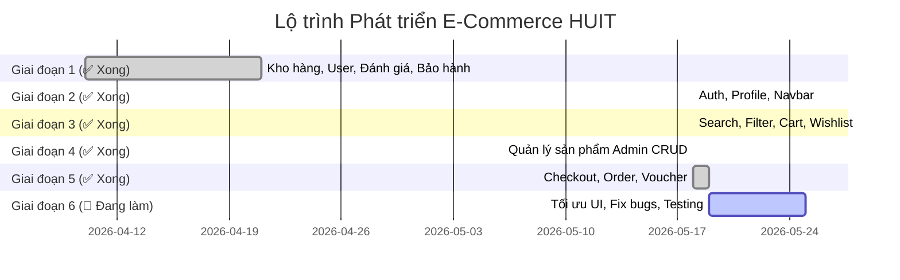

# 📋 KẾ HOẠCH PHÁT TRIỂN & TRIỂN KHAI HỆ THỐNG E-COMMERCE HUIT

Tài liệu này dùng để theo dõi tiến độ phát triển các giao diện và chức năng của dự án **E-Commerce HUIT** (ASP.NET MVC 5 + LINQ to SQL).

> **Cập nhật 19/05/2026**: Tất cả 12 module (Giai đoạn 1–5) đã hoàn thành. Đang ở **Giai đoạn 6: Tối ưu UI & Bug Fix**.

---

## 🛠️ PHÂN CHIA GIAI ĐOẠN PHÁT TRIỂN (ROADMAP)

---

## 📝 DANH SÁCH CHI TIẾT CÁC NHIỆM VỤ (TASK LIST)

### 🟢 GIAI ĐOẠN 1: CORE SYSTEM & INFRASTRUCTURE (ĐÃ HOÀN THÀNH)

- [x] **1. Quản lý kho hàng (Admin)**
  - [x] Thiết kế Database cho các bảng `warehouses`, `inventories`, `product_serials`, `stock_movements`, `suppliers`
  - [x] Viết `IInventoryService` & `InventoryService` xử lý nhập/xuất kho, thống kê tồn kho nâng cao
  - [x] Tạo `InventoryController` phục vụ Admin
  - [x] Thiết kế view `Dashboard.cshtml` biểu diễn KPI, biểu đồ phân phối hàng hóa
  - [x] Thiết kế view `ReorderReport.cshtml` báo cáo hàng sắp hết thông minh (Urgent/Warning/OK)
  - [x] Thiết kế views nhập hàng (`Import.cshtml`), chuyển kho (`Transfer.cshtml`), lịch sử xuất nhập (`History.cshtml`)
  
- [x] **2. Quản lý người dùng (Admin)**
  - [x] Thiết kế Database cho các bảng `users`, `addresses`, `permissions`, `role_permissions`
  - [x] Viết `IUserService` & `UserService` hỗ trợ lọc nâng cao, log lịch sử hoạt động
  - [x] Tích hợp chức năng Khóa / Mở khóa hàng loạt (`BulkUpdateUserStatusAsync`)
  - [x] Tích hợp đổi phân quyền hàng loạt (`BulkUpdateUserRoleAsync`)
  - [x] Giao diện `IndexEnhanced.cshtml` tích hợp hộp kiểm chọn nhiều hàng loạt, bộ lọc thông minh
  - [x] View chi tiết hoạt động của người dùng (`Details.cshtml`)

- [x] **3. Đánh giá và phản hồi (Admin & User)**
  - [x] Thiết kế Database cho bảng `reviews` (Đánh giá) và `review_responses` (Admin phản hồi)
  - [x] Cài đặt `IReviewService` & `ReviewService` xử lý phê duyệt, gửi đánh giá, xếp hạng trung bình
  - [x] Sửa lỗi compiler và liên kết bảng trong file `HuitShopDB.designer.cs` cho thực thể `review_responses`
  - [x] Thiết kế view `Submit.cshtml` cho khách hàng viết review (tích hợp star rating, verify badge, upload tối đa 5 hình ảnh)
  - [x] Thiết kế view `Manage.cshtml` cho Admin kiểm duyệt và phản hồi bình luận trực quan

- [x] **4. Quản lý bảo hành**
  - [x] Thiết kế Database cho bảng bảo hành & chính sách
  - [x] Viết `IWarrantyService` & `WarrantyService` kiểm tra bảo hành qua Serial/IMEI, duyệt/từ chối yêu cầu
  - [x] Tạo `WarrantyController` với các action gửi claim và xử lý phía Admin
  - [x] Thiết kế view `Claim.cshtml` cho phép khách hàng tra cứu IMEI và điền đơn yêu cầu (Sửa chữa, Đổi mới, Hoàn tiền)
  - [x] Thiết kế view `MyClaims.cshtml` hiển thị tiến trình xử lý yêu cầu bảo hành dưới dạng timeline trực quan
  - [x] Thiết kế view `ManageClaims.cshtml` cho Admin phân công kỹ thuật viên, cập nhật trạng thái yêu cầu

---

### 🟢 GIAI ĐOẠN 2: HỆ THỐNG TRUY CẬP & ĐỊNH DANH (ĐÃ HOÀN THÀNH)

- [x] **5. Đăng ký / Đăng nhập**
  - [x] Thiết kế và tạo `AuthController.cs` trong thư mục `Controllers`
  - [x] Thiết kế View Đăng nhập (`Views/Auth/Login.cshtml`) giao diện hiện đại, responsive
  - [x] Thiết kế View Đăng ký (`Views/Auth/Register.cshtml`) hỗ trợ validate mật khẩu mạnh, email, số điện thoại
  - [x] Tích hợp cơ chế Authentication Cookie hoặc Session lưu trữ trạng thái đăng nhập
  - [x] Thiết kế logic xác thực đăng ký/đăng nhập trong `AuthService`
  - [x] Xử lý Phân quyền và Bảo mật (Authorize Attribute) phân chia Admin, Staff, Customer
  
- [x] **6. Quản lý hồ sơ (User Profile)**
  - [x] Bổ sung các action Profile vào `UserController` phục vụ Client
  - [x] Thiết kế View `Views/User/Profile.cshtml` hiển thị thông tin cá nhân cơ bản (Họ tên, email, sđt, avatar)
  - [x] Cài đặt form cập nhật thông tin cá nhân và Avatar URL
  - [x] Tích hợp tính năng Quản lý Sổ địa chỉ (`Addresses`) - cho phép thêm/sửa/xóa nhiều địa chỉ giao hàng
  - [x] Hiển thị thống kê tổng đơn hàng và tích lũy chi tiêu ngay trên trang cá nhân

---

### 🟢 GIAI ĐOẠN 3: DUYỆT SẢN PHẨM & TRẢI NGHIỆM DUYỆT WEB (ĐÃ HOÀN THÀNH)

- [x] **7. Tìm kiếm và bộ lọc**
  - [x] Nâng cấp view `Views/Product/Index.cshtml` với giao diện Sidebar lọc sản phẩm hiện đại
  - [x] Phát triển bộ lọc Danh mục sản phẩm (cây danh mục đa cấp dựa trên `parent_id`)
  - [x] Phát triển bộ lọc Thương hiệu (Brand checklist) kết hợp bộ lọc giá bán (Price Range Slider sử dụng NoUiSlider)
  - [x] Tích hợp tính năng Tìm kiếm nhanh (Instant Search) với gợi ý từ khóa AJAX
  - [x] Tích hợp các bộ lọc sắp xếp (Mới nhất, Giá tăng dần, Giá giảm dần, Bán chạy nhất)
  
- [x] **8. Giỏ hàng & Yêu thích (Cart & Wishlist)**
  - [x] Xây dựng `CartController.cs` kết nối với `CartService` đã có
  - [x] Thiết kế trang Giỏ hàng (`Views/Cart/Index.cshtml`) cho phép cập nhật số lượng trực tiếp (AJAX) và xóa sản phẩm
  - [x] Thiết kế Drawer/Mini-cart trượt từ bên phải để tăng tính tương tác trên trang chủ
  - [x] Phát triển tính năng Danh sách yêu thích (Wishlist) cho phép lưu sản phẩm yêu thích của User
  - [x] Lưu trạng thái giỏ hàng vào Database đối với User đã đăng nhập, Cookie/Session đối với khách vãng lai

---

### 🟢 GIAI ĐOẠN 4: HỆ THỐNG QUẢN TRỊ SẢN PHẨM (ĐÃ HOÀN THÀNH)

- [x] **9. Quản lý sản phẩm (Admin - CRUD)**
  - [x] Bổ sung khu vực quản trị Admin cho Products trong `ProductController`
  - [x] Thiết kế View danh sách quản lý sản phẩm của Admin với tính năng lọc, phân trang
  - [x] Thiết kế View Thêm mới sản phẩm (`Views/Product/Create.cshtml`) tích hợp chọn danh mục, thương hiệu, nhập specs dạng JSON
  - [x] Thiết kế View Chỉnh sửa sản phẩm (`Views/Product/Edit.cshtml`)
  - [x] Phát triển giao diện quản lý Biến thể (Variants) - cấu hình giá, SKU, kho hàng cho từng màu sắc/dung lượng sản phẩm
  - [x] Tích hợp thư viện upload nhiều ảnh sản phẩm, sắp xếp vị trí hiển thị ảnh (`product_images`)

---

### 🟢 GIAI ĐOẠN 5: GIAO DỊCH THƯƠNG MẠI & ĐƠN HÀNG (ĐÃ HOÀN THÀNH ✅)

- [x] **10. Thanh toán (Checkout Flow)**
  - [x] Xây dựng quy trình thanh toán đa bước (Multi-step Checkout) trực quan:
    - *Bước 1*: Thông tin vận chuyển (Chọn từ Sổ địa chỉ hoặc nhập mới)
    - *Bước 2*: Lựa chọn hình thức thanh toán (COD, Chuyển khoản, MoMo - QR demo)
    - *Bước 3*: Áp dụng mã giảm giá (Voucher) qua AJAX
    - *Bước 4*: Xác nhận đơn hàng & Tóm tắt chi phí (Tạm tính, Giảm giá, Phí ship, Tổng)
  - [x] Thiết kế View `Views/Cart/Checkout.cshtml` phục vụ quy trình này
  - [x] Thiết kế View `Views/Cart/OrderConfirmation.cshtml` trang cảm ơn + timeline
  - [x] Viết logic kiểm tra tồn kho tại thời điểm checkout, tăng `quantity_reserved`
  - [x] Phí ship tự động: Miễn phí từ 500.000đ, dưới đó thu 30.000đ

- [x] **11. Quản lý đơn hàng**
  - [x] Xây dựng `OrderController.cs` xử lý đơn hàng (User + Admin)
  - [x] Thiết kế trang Lịch sử mua hàng (`Views/Order/History.cshtml`) với tabs lọc trạng thái
  - [x] Thiết kế trang Chi tiết đơn hàng (`Views/Order/Details.cshtml`) kèm timeline dọc trực quan
  - [x] Xây dựng trang Quản lý Đơn hàng cho Admin (`Views/Order/Manage.cshtml`)
    - KPI Stats Dashboard (Chờ xử lý, Xác nhận, Đang giao, Hoàn tất, Đã hủy)
    - Hỗ trợ đổi trạng thái đơn hàng qua AJAX (PENDING→CONFIRMED→SHIPPING→COMPLETED/CANCELLED)
    - Cơ chế gán Serial Number via AssignSerial AJAX action

- [x] **12. Quản lý khuyến mãi (Promotion)**
  - [x] Tạo `VoucherController.cs` phục vụ nghiệp vụ Admin & áp dụng Voucher
  - [x] Thiết kế giao diện Quản lý Voucher cho Admin (`Views/Voucher/Index.cshtml`, `Create.cshtml`, `Edit.cshtml`)
    - Cấu hình mã, loại giảm (PERCENT/FIXED), giảm tối đa, min order, ngày bắt đầu/kết thúc, giới hạn lượt
    - Toggle trạng thái AJAX, usage bar progress
  - [x] Tích hợp API áp dụng voucher bằng AJAX tại trang Checkout (`/Voucher/Apply`)
  - [x] Cập nhật `usage_count` và ghi nhận `voucher_usages` khi thanh toán thành công
  - [x] CartService: ApplyVoucherAsync, RemoveVoucherAsync với full validation logic
